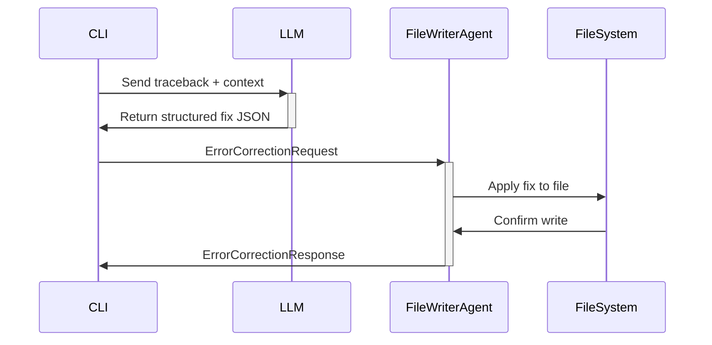

## Overview

splat uses an agent-based architecture to handle code modifications and error corrections autonomously. The system leverages two agent frameworks:

1. **uagents** (by Fetch.ai): For file writing and code application
2. **pydantic-ai**: For structured error analysis and debugging

<Note>
  Agents operate independently with their own lifecycle, message handling, and REST endpoints. This allows for distributed, asynchronous error correction.
</Note>

## Agent Architecture

The agent system consists of two primary agents:

### 1. File Writer Agent (uagents)

Located in `agents/file_writer_agent.py`, this agent handles all file modification operations.

```python
from uagents import Agent, Context, Model

file_writer = Agent(
    name="file_writer", 
    seed="file_writer_seed", 
    port=8000, 
    endpoint="http://localhost:8000/submit"
)
```

**Key Features:**
- Runs on port 8000
- Exposes REST endpoint for corrections
- Handles whitespace preservation
- Supports both direct writes and error corrections

### 2. Bug Zapper Agent (pydantic-ai)

Located in `agents/agents.py`, this agent performs structured error analysis.

```python
from pydantic_ai import Agent, RunContext
from pydantic import BaseModel, Field

class ZapperResult(BaseModel):
    path: str = Field("The path to the file where the error occurs")
    file: str = Field("The name of the file with the error")
    line: int = Field("Which line the error occured in", ge=0)
    what: str = Field("Explanation in natural language of what the error is")
    todo: str = Field("Describe steps to take in natural language to fix the error")

bug_zapper = Agent(
    model_name=os.getenv('MODEL'),
    api_key=os.getenv('API_KEY'),
    deps_type=FlagDependencies,
    result_type=ZapperResult,
    system_prompt=(
        'You are an expert software debugging assistant...'
    )
)
```

## Message Models

Agents communicate using structured Pydantic models:

### FileWriteRequest

```python
class FileWriteRequest(Model):
    file_path: str
    content: str
```

Used for direct file writes. The agent receives this message and writes the content to the specified path.

### FileWriteResponse

```python
class FileWriteResponse(Model):
    success: bool
    message: str
```

Returned after write operations to indicate success or failure.

### ErrorCorrectionRequest

```python
class ErrorCorrectionRequest(Model):
    response: dict
```

The `response` dict must contain the structured JSON from the LLM:

```json
{
  "where": {
    "repository_path": "/absolute/path/to/repo",
    "file_name": "script.py",
    "line_number": "42"
  },
  "what": {
    "error_type": "SyntaxError",
    "description": "Missing closing parenthesis"
  },
  "how": {
    "error_origination": "42",
    "suggested_code_solution": "print(hello)\\n"
  }
}
```

### ErrorCorrectionResponse

```python
class ErrorCorrectionResponse(Model):
    success: bool
    message: str
```

## Agent Message Handlers

### Startup Handler

```python
@file_writer.on_event("startup")
async def startup(ctx: Context):
    ctx.logger.info(f"Starting up {file_writer.name} agent @ {file_writer.address}")
```

Logs agent initialization with name and address.

### File Write Handler

```python
@file_writer.on_message(model=FileWriteRequest)
async def write_to_file(ctx: Context, sender: str, msg: FileWriteRequest):
    try:
        with open(msg.file_path, 'w') as file:
            file.write(msg.content)
        ctx.logger.info(f"Successfully wrote to file: {msg.file_path}")
        await ctx.send(
            sender, 
            FileWriteResponse(
                success=True, 
                message=f"File {msg.file_path} updated successfully"
            )
        )
    except Exception as e:
        error_message = f"Error writing to file {msg.file_path}: {str(e)}"
        ctx.logger.error(error_message)
        await ctx.send(
            sender, 
            FileWriteResponse(success=False, message=error_message)
        )
```

<Accordion title="How File Writing Works">
  1. Agent receives `FileWriteRequest` message
  2. Opens file in write mode ('w')
  3. Writes content completely, overwriting existing content
  4. Logs success or error
  5. Sends `FileWriteResponse` back to sender
  
  **Note**: This is a full file overwrite, not a line-by-line edit.
</Accordion>

### Error Correction Handler

This is the core handler that applies LLM-suggested fixes:

```python
@file_writer.on_message(model=ErrorCorrectionRequest)
async def apply_error_correction(ctx: Context, sender: str, msg: ErrorCorrectionRequest):
    try:
        response = msg.response
        
        # Extract fix information from LLM response
        file_path = os.path.join(
            response['where']['repository_path'], 
            response['where']['file_name']
        )
        line_number = int(response['where']['line_number'])
        suggested_code = response['how']['suggested_code_solution']
        
        # Read entire file
        with open(file_path, 'r', encoding='utf-8') as file:
            lines = file.readlines()
        
        # Apply fix with whitespace preservation
        if 0 < line_number <= len(lines):
            stripped_line = lines[line_number - 1].strip()
            num_whitespace = len(lines[line_number - 1]) - len(stripped_line)
            lines[line_number - 1] = " " * num_whitespace + suggested_code
            
            # Write back modified content
            with open(file_path, 'w', encoding='utf-8') as file:
                file.writelines(lines)
            
            ctx.logger.info(f"Successfully applied correction to file: {file_path}")
            await ctx.send(
                sender, 
                FileWriteResponse(
                    success=True, 
                    message=f"File {file_path} updated successfully"
                )
            )
        else:
            raise IndexError("Line number out of range")
    except Exception as e:
        error_message = f"Error applying correction: {str(e)}"
        ctx.logger.error(error_message)
        await ctx.send(
            sender, 
            FileWriteResponse(success=False, message=error_message)
        )
```

<Steps>
  <Step title="Extract Fix Information">
    Parse the LLM response JSON to get file path, line number, and suggested code
  </Step>
  
  <Step title="Read File">
    Load entire file into memory as list of lines
  </Step>
  
  <Step title="Preserve Indentation">
    Calculate whitespace at beginning of original line to maintain code structure
  </Step>
  
  <Step title="Apply Fix">
    Replace the erroneous line with suggested code, preserving indentation
  </Step>
  
  <Step title="Write Back">
    Write modified lines back to file
  </Step>
  
  <Step title="Send Response">
    Notify sender of success or failure
  </Step>
</Steps>

<Warning>
  The agent currently applies fixes line-by-line. Multi-line fixes are not yet supported. The LLM must provide a single-line solution.
</Warning>

## Whitespace Preservation

One of the critical features is maintaining proper indentation:

```python
# Original line with indentation
lines[line_number - 1] = "    print(hello\\n"  # 4 spaces

# Extract whitespace
stripped_line = lines[line_number - 1].strip()  # "print(hello\\n"
num_whitespace = len(lines[line_number - 1]) - len(stripped_line)  # 4

# Apply fix with same indentation
lines[line_number - 1] = " " * num_whitespace + suggested_code
# Result: "    print(hello)\\n"  # 4 spaces preserved
```

This ensures fixes don't break Python's indentation-sensitive syntax.

## REST Endpoints

### POST /apply_correction

The file writer agent exposes a REST endpoint for external correction requests:

```python
@file_writer.on_rest_post(
    "/apply_correction", 
    ErrorCorrectionRequest, 
    ErrorCorrectionResponse
)
async def handle_error_correction(
    ctx: Context, 
    request: ErrorCorrectionRequest
) -> ErrorCorrectionResponse:
    try:
        await apply_error_correction(ctx, file_writer.address, request)
        return ErrorCorrectionResponse(
            success=True, 
            message="Error correction applied successfully"
        )
    except Exception as e:
        print(str(e))
        return ErrorCorrectionResponse(
            success=False, 
            message=f"Error applying correction: {str(e)}"
        )
```

**Usage Example:**

```bash
curl -X POST http://localhost:8000/apply_correction \
  -H "Content-Type: application/json" \
  -d '{
    "response": {
      "where": {
        "repository_path": "/home/user/project",
        "file_name": "script.py",
        "line_number": "42"
      },
      "how": {
        "suggested_code_solution": "print(hello)\\n"
      }
    }
  }'
```

## Agent Communication Patterns

### Async Message Passing

Agents use async/await for non-blocking message handling:

```python
# Sender
await ctx.send(receiver_address, FileWriteRequest(
    file_path="/path/to/file.py",
    content="new content"
))

# Receiver
@agent.on_message(model=FileWriteRequest)
async def handler(ctx: Context, sender: str, msg: FileWriteRequest):
    # Process message
    await ctx.send(sender, FileWriteResponse(success=True, message="Done"))
```

### Request-Response Pattern

<CodeGroup>

```python Request
# External system sends correction request
request = ErrorCorrectionRequest(response={
    "where": {...},
    "what": {...},
    "how": {...}
})

await ctx.send(file_writer_address, request)
```

```python Response
# Agent processes and responds
@file_writer.on_message(model=ErrorCorrectionRequest)
async def apply_correction(ctx, sender, msg):
    # Apply fix...
    await ctx.send(sender, FileWriteResponse(
        success=True,
        message="Fix applied"
    ))
```

</CodeGroup>

## Agent Lifecycle

```python
if __name__ == "__main__":
    print("Starting file writer agent server on http://localhost:8000")
    file_writer.run()
```

<Steps>
  <Step title="Initialization">
    Agent is created with name, seed, port, and endpoint
  </Step>
  
  <Step title="Startup Event">
    `on_event("startup")` handler is called, logging agent info
  </Step>
  
  <Step title="Ready State">
    Agent begins listening for messages on configured port (8000)
  </Step>
  
  <Step title="Message Handling">
    Incoming messages are routed to appropriate handlers based on model type
  </Step>
  
  <Step title="REST Serving">
    HTTP endpoint `/apply_correction` becomes available
  </Step>
</Steps>

## Error Handling

Agents implement comprehensive error handling:

```python
try:
    # Attempt operation
    with open(file_path, 'w') as file:
        file.write(content)
    
    # Log success
    ctx.logger.info(f"Success: {file_path}")
    
    # Send success response
    await ctx.send(sender, FileWriteResponse(success=True, message="Done"))
    
except Exception as e:
    # Log error
    error_message = f"Error: {str(e)}"
    ctx.logger.error(error_message)
    
    # Send failure response
    await ctx.send(sender, FileWriteResponse(success=False, message=error_message))
```

All errors are:
1. Caught and logged
2. Sent back to the sender
3. Prevent agent crashes

## Future Enhancements

The codebase includes commented-out code for future features:

```python
# Commented out: Automatic code formatting with Black
'''
with open(file_path, 'r') as file:
    content = file.read()
    formatted_content = black.format(content, mode=black.FileMode())
    
with open(file_path, 'w') as file:
    file.write(formatted_content)
'''
```

This would automatically format fixed code using Black after applying corrections.

## Agent Dependencies

### FlagDependencies (pydantic-ai)

```python
@dataclass
class FlagDependencies:
    flag: str
    file_path: Union[str, Path]
    
    def __post_init__(self):
        try:
            self.file_path = Path(self.file_path)
            if not self.file_path.exists():
                cwd = os.getcwd()
        except OSError as e:
            # Handle file access errors
            pass
```

Provides context about CLI flags and file paths to the bug zapper agent.

## Integration with Main Pipeline

The agent system integrates into splat's main pipeline:

1. **Error Analysis**: LLM generates structured JSON response
2. **Agent Invocation**: Response is sent to file writer agent
3. **Application**: Agent applies fix to source code
4. **Feedback**: Success/failure is reported back to CLI



<Note>
  Agents operate independently and could be distributed across multiple machines or containers in a production deployment.
</Note>

## Next Steps

<CardGroup cols={2}>
  <Card title="Architecture" icon="sitemap" href="/advanced/architecture">
    Understand how agents fit into the overall system architecture
  </Card>
  
  <Card title="Terminal Integration" icon="terminal" href="/advanced/terminal-integration">
    Learn how agents interact with the terminal monitoring system
  </Card>
</CardGroup>