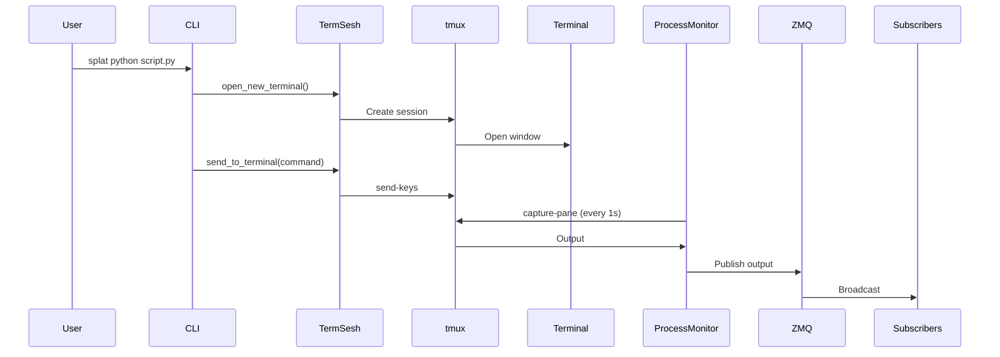

## Overview

splat provides sophisticated terminal integration through tmux session management and ZMQ-based messaging. This allows for:

- Interactive terminal sessions
- Real-time output capture
- Process monitoring
- Code segment transmission
- Cross-platform support (macOS, Linux)

<Note>
  The terminal integration system uses tmux as a multiplexer and ZMQ for pub-sub messaging, creating a robust, platform-independent solution.
</Note>

## TermSesh: Terminal Session Manager

Located in `cli/term_sesh.py`, the `TermSesh` class is the core terminal management component.

### Initialization

```python
class TermSesh:
    monitor: Optional[ProcessMonitor]
    
    def __init__(self, port=5555, terminal_app=None, session_name='zapper_session'):
        self.context = zmq.Context()
        self.publisher = self.context.socket(zmq.PUB)
        self.publisher.bind(f"tcp://*:{port}")
        self.system = platform.system()
        self.session_name = session_name
        self.terminal_process = None
        self.monitor = None
        self.tmux_stack = [""]
```

**Components:**
- **ZMQ Context**: Creates messaging context
- **Publisher Socket**: Broadcasts on port 5555 (default)
- **System Detection**: Identifies OS for platform-specific behavior
- **Session Name**: Unique identifier for tmux session (default: `zapper_session`)
- **tmux Stack**: Tracks terminal output history

## ZMQ Publisher/Subscriber Pattern

### Publishing Code Segments

```python
def send_code_segment(self, code_data):
    """
    Send code segments with metadata
    code_data = {
        'file_path': 'path/to/file',
        'code': 'actual code content',
        'metadata': {...},
        'action': 'analyze/edit/debug'
    }
    """
    # Compress the code content
    compressed_code = base64.b64encode(
        zlib.compress(code_data['code'].encode())
    ).decode()
    code_data['code'] = compressed_code
    
    # Send the data
    self.publisher.send_json(code_data)
```

<Accordion title="Why Compression?">
  Code segments can be large, especially when sending entire files. Using zlib compression with base64 encoding:
  
  1. Reduces network bandwidth
  2. Speeds up transmission
  3. Maintains text-safe encoding
  
  The compression ratio for source code is typically 60-80%, significantly reducing message size.
</Accordion>

### Message Format

Messages sent via ZMQ follow this structure:

```json
{
  "file_path": "src/module.py",
  "code": "eJxLLEnULS4pSk0uUbJSqE4tLk5NzNFRykvMTVWyUgYA8nEJ2A==",
  "metadata": {
    "language": "python",
    "lines": 42,
    "timestamp": 1709078400.0
  },
  "action": "analyze"
}
```

**Fields:**
- `file_path`: Relative or absolute path to file
- `code`: Base64-encoded, zlib-compressed code content
- `metadata`: Optional contextual information
- `action`: Operation type (`analyze`, `edit`, `debug`)

## tmux Session Management

### Creating Sessions

```python
def open_new_terminal(self):
    """Create an interactive terminal session with proper error handling"""
    try:
        # Clean up any existing session
        self.kill_tmux_session()
        
        # Create new detached tmux session
        subprocess.run(['tmux', 'new-session', '-d', '-s', self.session_name])
        
        # Open platform-specific terminal window
        if platform.system() == "Darwin":  # macOS
            apple_script = f'''
                tell application "Terminal"
                    do script "tmux attach-session -t {self.session_name}"
                end tell
            '''
            subprocess.Popen(['osascript', '-e', apple_script])
        elif platform.system() == "Linux":
            subprocess.Popen([
                'gnome-terminal', '--', 'tmux', 'attach-session', '-t', self.session_name
            ])
        else:
            raise NotImplementedError("Windows not yet supported")
        
        # Allow time for session to start
        time.sleep(1)
        
        return True
    except Exception as e:
        print(f"Error creating tmux session: {e}")
        traceback.print_exc()
        return False
```

<Steps>
  <Step title="Kill Existing Session">
    Ensures no conflicting sessions with same name exist
  </Step>
  
  <Step title="Create Detached Session">
    `tmux new-session -d` creates session in background
  </Step>
  
  <Step title="Platform Detection">
    Uses AppleScript on macOS, gnome-terminal on Linux
  </Step>
  
  <Step title="Attach Terminal">
    Opens new terminal window and attaches to tmux session
  </Step>
  
  <Step title="Initialization Delay">
    1-second sleep ensures session is fully initialized
  </Step>
</Steps>

### Cross-Platform Support

<CodeGroup>

```applescript macOS
tell application "Terminal"
    do script "tmux attach-session -t zapper_session"
end tell
```

```bash Linux
gnome-terminal -- tmux attach-session -t zapper_session
```

</CodeGroup>

<Warning>
  Windows is not currently supported. The system raises `NotImplementedError` on Windows platforms.
</Warning>

### Killing Sessions

```python
def kill_tmux_session(self):
    """Kill the tmux session if it exists"""
    try:
        # Check if session exists
        result = subprocess.run(
            ['tmux', 'has-session', '-t', self.session_name],
            capture_output=True
        )
        if result.returncode == 0:  # Session exists
            subprocess.run(['tmux', 'kill-session', '-t', self.session_name])
            print(f"Killed tmux session: {self.session_name}")
    except Exception as e:
        print(f"Error killing tmux session: {e}")
```

This is called before creating new sessions to prevent conflicts.

## Output Capture and Cleaning

### Reading tmux Output

```python
def read_tmux_output(self):
    """Read output from the tmux session"""
    try:
        result = subprocess.run(
            ['tmux', 'capture-pane', '-t', self.session_name, '-p'], 
            capture_output=True, 
            text=True
        )
        if result.stdout:
            cleaned_output = self.clean_tmux_output(result.stdout)
            self.tmux_stack.append(cleaned_output)
            
            # Return only new output since last read
            if len(self.tmux_stack[-2]) < len(cleaned_output):
                print(cleaned_output[len(self.tmux_stack[-2]):])
                return cleaned_output[len(self.tmux_stack[-2]):]
        return ""
    except Exception as e:
        print(f"Error reading tmux session: {e}")
        return ""
```

**Key Features:**
- Uses `tmux capture-pane -p` to get current pane content
- Cleans output with `clean_tmux_output()`
- Tracks output history in `tmux_stack`
- Returns only incremental changes (diff)

### Output Cleaning

```python
def clean_tmux_output(self, raw_output: str) -> str:
    """Clean and format tmux output by removing ANSI escape sequences and extra whitespace"""
    import re
    
    # Remove ANSI escape sequences
    ansi_escape = re.compile(r'\x1B(?:[@-Z\\-_]|\[[0-?]*[ -/]*[@-~])')
    # Remove unicode characters commonly used in prompts
    unicode_chars = re.compile(r'[\ue0b0-\ue0b3\ue5ff\ue615\ue606\uf48a\uf489\ue0a0]')
    
    # Clean the output
    cleaned = ansi_escape.sub('', raw_output)
    cleaned = unicode_chars.sub('', cleaned)
    
    # Split into lines and remove empty lines
    lines = [line.strip() for line in cleaned.split('\n')]
    lines = [line for line in lines if line]
    
    # Remove duplicate consecutive lines
    unique_lines = []
    prev_line = None
    for line in lines:
        if line != prev_line:
            unique_lines.append(line)
            prev_line = line
    
    return '\n'.join(unique_lines)
```

<Accordion title="What Gets Cleaned?">
  
  **ANSI Escape Sequences:**
  - Color codes (e.g., `\x1B[31m` for red)
  - Cursor movement codes
  - Text formatting (bold, underline)
  
  **Unicode Characters:**
  - Powerline symbols (arrows, triangles)
  - Special prompt characters
  - Non-standard glyphs
  
  **Duplicates:**
  - Consecutive identical lines
  - Empty lines
  
  **Result:** Clean, readable text suitable for LLM processing or display.
</Accordion>

## Command Execution

```python
def send_to_terminal(self, command: str) -> Optional[str]:
    """Send a command to the tmux session"""
    try:
        subprocess.run([
            'tmux', 'send-keys', '-t', self.session_name, command, 'C-m'
        ])
        return "Command sent"
    except Exception as e:
        print(f"Error sending to tmux session: {e}")
        return None
```

**How it Works:**
- `tmux send-keys`: Sends keystrokes to tmux pane
- `-t self.session_name`: Targets specific session
- `command`: The command string
- `'C-m'`: Simulates pressing Enter (carriage return)

**Example Usage:**
```python
term = TermSesh()
term.open_new_terminal()
term.send_to_terminal('python script.py')
```

## Process Monitoring

Located in `cli/process_monitor.py`, the `ProcessMonitor` class watches tmux output.

```python
class ProcessMonitor:
    def __init__(self, term_sesh):
        self.term_sesh = term_sesh
        self.monitor_thread = None
        self.is_running = False
    
    def start_monitoring(self):
        self.is_running = True
        self.monitor_thread = threading.Thread(target=self.monitor_tmux)
        self.monitor_thread.daemon = True
        self.monitor_thread.start()
        print('monitor thread starting')
```

### Monitoring Loop

```python
def monitor_tmux(self):
    while self.is_running:
        output = self.term_sesh.read_tmux_output()
        if output:
            self.term_sesh.publisher.send_json({
                'type': 'tmux_output',
                'data': output,
                'timestamp': time.time()
            })
        time.sleep(1)
```

<Steps>
  <Step title="Read Output">
    Calls `term_sesh.read_tmux_output()` every second
  </Step>
  
  <Step title="Check for Changes">
    Only proceeds if new output detected
  </Step>
  
  <Step title="Publish via ZMQ">
    Broadcasts output with timestamp to all subscribers
  </Step>
  
  <Step title="Repeat">
    Loops with 1-second polling interval
  </Step>
</Steps>

### Message Structure

```json
{
  "type": "tmux_output",
  "data": "python script.py\nSyntaxError: invalid syntax\n",
  "timestamp": 1709078400.123
}
```

## Terminal Lifecycle

### Status Checking

```python
def is_terminal_active(self) -> bool:
    """Check if terminal session is active and valid"""
    return (self.terminal_process is not None and
            self.terminal_process.poll() is None)
```

Returns `True` if the terminal process is running.

### Complete Workflow

```python
# Initialize
term = TermSesh(port=5555, session_name='my_session')

# Create tmux session and open terminal
term.open_new_terminal()

# Start monitoring
monitor = ProcessMonitor(term)
monitor.start_monitoring()

# Execute commands
term.send_to_terminal('cd /path/to/project')
term.send_to_terminal('python script.py')

# Read output
output = term.read_tmux_output()

# Send code segments
term.send_code_segment({
    'file_path': 'script.py',
    'code': 'print("hello")',
    'action': 'analyze'
})

# Cleanup
term.kill_tmux_session()
```

## Integration with Error Correction

The terminal integration fits into splat's pipeline:



## Advanced Features

### Output Diffing

The `tmux_stack` tracks output history to compute diffs:

```python
self.tmux_stack.append(cleaned_output)
if len(self.tmux_stack[-2]) < len(cleaned_output):
    # Return only new content
    return cleaned_output[len(self.tmux_stack[-2]):]
```

This prevents redundant output from being processed multiple times.

### Daemon Threads

The monitor runs as a daemon thread:

```python
self.monitor_thread.daemon = True
```

This ensures the thread exits when the main program terminates, preventing zombie processes.

### Error Recovery

All terminal operations include try-except blocks:

```python
try:
    subprocess.run(['tmux', 'send-keys', ...])
    return "Command sent"
except Exception as e:
    print(f"Error sending to tmux session: {e}")
    return None
```

This prevents crashes from propagating and provides debugging information.

## Platform Differences

| Feature | macOS | Linux | Windows |
|---------|-------|-------|----------|
| Terminal App | Terminal.app | gnome-terminal | Not Supported |
| Script Language | AppleScript | Bash | N/A |
| tmux | Supported | Supported | Not Available |
| ZMQ | Supported | Supported | Supported |

<Note>
  While ZMQ works on Windows, tmux does not. Windows support would require WSL or alternative terminal multiplexer.
</Note>

## Configuration

### Port Selection

```python
term = TermSesh(port=5555)  # Default
term = TermSesh(port=5556)  # Custom
```

Choose different ports if running multiple instances.

### Session Naming

```python
term = TermSesh(session_name='zapper_session')  # Default
term = TermSesh(session_name='debug_session')   # Custom
```

Unique names allow multiple concurrent sessions.

## Debugging Terminal Issues

### Check tmux Sessions

```bash
# List all sessions
tmux list-sessions

# Attach to session manually
tmux attach-session -t zapper_session

# View session output
tmux capture-pane -t zapper_session -p
```

### ZMQ Subscriber Test

```python
import zmq

context = zmq.Context()
subscriber = context.socket(zmq.SUB)
subscriber.connect("tcp://localhost:5555")
subscriber.setsockopt_string(zmq.SUBSCRIBE, "")

while True:
    message = subscriber.recv_json()
    print(message)
```

## Performance Considerations

- **Polling Interval**: 1-second default balances responsiveness and CPU usage
- **Compression**: Reduces network overhead for large code segments
- **Incremental Output**: Only new output is processed and published
- **Daemon Threads**: Prevent resource leaks on program exit

## Next Steps

<CardGroup cols={2}>
  <Card title="Architecture" icon="sitemap" href="/advanced/architecture">
    See how terminal integration fits into the overall system
  </Card>
  
  <Card title="Agent System" icon="robot" href="/advanced/agents">
    Learn how agents interact with terminal output
  </Card>
</CardGroup>