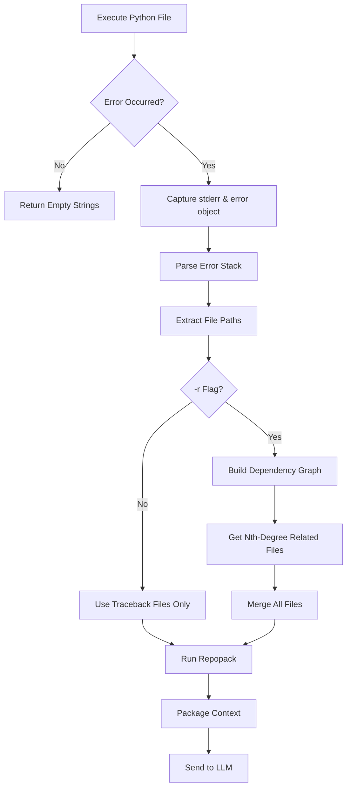

## Overview

Error analysis is the core of splat's intelligence—it transforms raw Python error tracebacks into structured, actionable debugging information. This process involves parsing error stacks, extracting relevant file paths, gathering comprehensive context, and preparing data for LLM analysis.

## Error Stack Parsing

When Python code fails, it produces a traceback showing the sequence of function calls leading to the error. Splat's `parse_error_stack()` function extracts file paths from these tracebacks (`utils.py:47-74`).

### Parsing Algorithm

```python
def parse_error_stack(error_info: str) -> List[str]:
    files = []
    # Regex matches: File "path/to/file.py" OR standalone .py references
    file_pattern = re.compile(r'(?:File "([^"]+)"|\b(\S+\.py)\b)')
    
    for line in error_info.split('\n'):
        matches = file_pattern.findall(line)
        for match in matches:
            file_path = next((m for m in match if m), None)
            if file_path:
                file_path = file_path.strip().strip('\'\"`')
                if os.path.exists(file_path):
                    files.append(file_path)
    
    return list(dict.fromkeys(files))  # Remove duplicates while preserving order
```

<Accordion title="What the Regex Captures">
The pattern `r'(?:File "([^"]+)"|\b(\S+\.py)\b)'` has two capture groups:

**Group 1: Quoted File Paths**
```python
File "/home/user/project/app.py", line 42
      ^^^^^^^^^^^^^^^^^^^^^^^^ captured
```

**Group 2: Standalone .py References**
```python
Traceback in script.py at line 10
             ^^^^^^^^^ captured
```

This dual-pattern approach catches file paths in various error message formats.
</Accordion>

### Example Error Stack

<Tabs>
  <Tab title="Raw Traceback">
    ```
    Traceback (most recent call last):
      File "/home/user/app.py", line 15, in <module>
        result = process_data(data)
      File "/home/user/utils.py", line 42, in process_data
        return transform(value)
      File "/home/user/transform.py", line 8, in transform
        return value.upper()
    AttributeError: 'NoneType' object has no attribute 'upper'
    ```
  </Tab>
  <Tab title="Parsed Output">
    ```python
    [
      '/home/user/app.py',
      '/home/user/utils.py',
      '/home/user/transform.py'
    ]
    ```
  </Tab>
</Tabs>

### Path Validation

<Info>
Only file paths that exist on the filesystem are included in the results. This prevents hallucinated or system library paths from cluttering the analysis.
</Info>

```python
if os.path.exists(file_path):
    files.append(file_path)
```

## Error Capture Process

Errors are captured by executing the Python file in a subprocess and catching the `CalledProcessError` exception (`relational.py:14-20`).

```python
try:
    subprocess.run(entrypoint, capture_output=True, check=True, text=True)
    return "", "", ""  # No error
except subprocess.CalledProcessError as error:
    traceback: str = error.stderr if error.stderr else str(error)
    error_information: str = str(error)
    collected_traceback_files = parse_error_stack(traceback)
```

### What Gets Captured

<CardGroup cols={2}>
  <Card title="stderr" icon="terminal">
    Complete error traceback with:
    - File paths and line numbers
    - Function call stack
    - Error type and message
    - Context lines (code snippets)
  </Card>
  <Card title="error object" icon="circle-exclamation">
    Additional metadata:
    - Return code
    - Command that was executed
    - Exit status
  </Card>
</CardGroup>

## Context Gathering with Repopack

Once file paths are extracted, splat uses `run_mock_repopack()` to gather the full contents of relevant files (`utils.py:81-100`).

### Repopack Function

```python
def run_mock_repopack(paths: List[str], style: str = 'json') -> str:
    result = []
    for path in paths:
        if os.path.exists(path):  # Skip hallucinated paths
            with open(path, 'r') as f:
                content = f.read()
            result.append(f"File: {path}\nContent:\n{content}\n")
    
    return "\n" + "="*50 + "\n".join(result) + "="*50 + "\n"
```

<Accordion title="Why 'Mock' Repopack?">
The function is named `run_mock_repopack` because it simulates what a full repopack implementation might do. In production, this could be replaced with an actual repopack integration that:
- Supports multiple output formats (JSON, XML, plain text)
- Adds syntax highlighting
- Includes metadata (file size, modification time)
- Supports filtering and exclusions

For now, the mock version provides the essential functionality: packaging file contents into a single string for LLM consumption.
</Accordion>

### Output Format

```
==================================================
File: /home/user/app.py
Content:
import sys
from utils import process_data

def main():
    data = None
    result = process_data(data)
    print(result)

if __name__ == "__main__":
    main()

==================================================
File: /home/user/utils.py
Content:
def process_data(data):
    return transform(data)

def transform(value):
    return value.upper()

==================================================
```

## Information Collected

Splat gathers three types of information for error analysis:

<Steps>
  <Step title="Traceback Message">
    The complete stderr output containing:
    - Stack trace with file paths and line numbers
    - Function names in the call stack
    - Error type (e.g., `AttributeError`, `NameError`)
    - Error message with specific details
    - Code context around the error line
  </Step>
  <Step title="Error Information">
    The stringified error object containing:
    - Command that was executed
    - Return code
    - Exit status
    - Any additional metadata from subprocess
  </Step>
  <Step title="File Context">
    Full contents of all relevant files:
    - Files mentioned in traceback (always)
    - Imported dependencies (with `-r` flag)
    - Nth-degree connections (with `-r` flag)
  </Step>
</Steps>

## Analysis Pipeline

The complete flow from error to analysis:



## Error Type Handling

Splat analyzes various Python error types:

<Tabs>
  <Tab title="Syntax Errors">
    ```python
    File "app.py", line 5
      print(hello
            ^
    SyntaxError: '(' was never closed
    ```
    **Extracted:** File path, line number, syntax issue
  </Tab>
  <Tab title="Runtime Errors">
    ```python
    File "app.py", line 10, in <module>
      result = data.upper()
    AttributeError: 'NoneType' object has no attribute 'upper'
    ```
    **Extracted:** Full call stack, error location, variable state
  </Tab>
  <Tab title="Import Errors">
    ```python
    File "app.py", line 1, in <module>
      from utils import missing_function
    ImportError: cannot import name 'missing_function'
    ```
    **Extracted:** Import statement, source file, target module
  </Tab>
  <Tab title="Type Errors">
    ```python
    File "app.py", line 8, in calculate
      return x + y
    TypeError: can only concatenate str (not "int") to str
    ```
    **Extracted:** Operation details, type mismatch info
  </Tab>
</Tabs>

## Context Window Optimization

To minimize token usage while maximizing fix accuracy:

### File Filtering

<CardGroup cols={2}>
  <Card title="Included" icon="check">
    - Files in error traceback
    - Project files only (no stdlib)
    - Files that exist on disk
    - Imported project modules
  </Card>
  <Card title="Excluded" icon="xmark">
    - Standard library files
    - Third-party packages
    - Virtual environment files
    - Non-existent paths
  </Card>
</CardGroup>

### Project Boundary Detection

```python
def is_project_file(file_path: str, project_root: str) -> bool:
    return os.path.commonpath([file_path, project_root]) == project_root
```

This ensures only files within your project are analyzed (`utils.py:38-39`).

## Edge Cases Handled

<Accordion title="Missing Files">
```python
if os.path.exists(file_path):
    files.append(file_path)
```
Files that don't exist (e.g., from installed packages) are silently skipped.
</Accordion>

<Accordion title="Syntax Errors in Dependencies">
```python
try:
    tree = ast.parse(content)
except SyntaxError:
    pass  # Continue without import information
```
If a dependency has syntax errors, it's still included but imports aren't parsed.
</Accordion>

<Accordion title="Duplicate Paths">
```python
return list(dict.fromkeys(files))  # Remove duplicates
```
The same file mentioned multiple times in the stack is only included once.
</Accordion>

<Accordion title="Quote Variants">
```python
file_path = file_path.strip("'\"\`")
```
Handles single quotes, double quotes, and backticks around file paths.
</Accordion>

## Real-World Analysis Example

<Tabs>
  <Tab title="Input Error">
    ```python
    $ splat 'python3 app.py'
    
    Traceback (most recent call last):
      File "/Users/dev/project/app.py", line 12, in <module>
        data = fetch_data()
      File "/Users/dev/project/api.py", line 25, in fetch_data
        return json.loads(response)
      File "/Library/Python/3.9/json/__init__.py", line 346, in loads
        return _default_decoder.decode(s)
    TypeError: the JSON object must be str, bytes or bytearray, not NoneType
    ```
  </Tab>
  <Tab title="Extracted Files">
    ```python
    [
      '/Users/dev/project/app.py',
      '/Users/dev/project/api.py'
      # json/__init__.py excluded (not in project)
    ]
    ```
  </Tab>
  <Tab title="Context Gathered">
    ```
    ==================================================
    File: /Users/dev/project/app.py
    Content:
    from api import fetch_data
    
    def main():
        data = fetch_data()
        print(data)
    
    if __name__ == "__main__":
        main()
    
    ==================================================
    File: /Users/dev/project/api.py
    Content:
    import requests
    import json
    
    def fetch_data():
        response = requests.get('https://api.example.com/data')
        # Bug: forgot to get response text
        return json.loads(response)  # Should be response.text
    ==================================================
    ```
  </Tab>
  <Tab title="Prepared for LLM">
    ```python
    process(
      traceback="Traceback (most recent call last)...TypeError: the JSON object...",
      error_info="Command '['python3', 'app.py']' returned non-zero exit status 1",
      repopack="...File: /Users/dev/project/app.py\nContent:\nfrom api..."
    )
    ```
  </Tab>
</Tabs>

## Performance Metrics

<Info>
**Typical parsing performance:**
- Error stack parsing: less than 10ms
- File path extraction: less than 5ms per file
- Context gathering: ~50-100ms per file (I/O bound)
- Total analysis prep: less than 500ms for most errors
</Info>

## Implementation Reference

<ResponseField name="parse_error_stack" type="function">
  **Location:** `utils.py:47-74`
  
  **Purpose:** Extract file paths from Python error tracebacks
  
  **Parameters:**
  - `error_info: str` - Full error traceback as string
  
  **Returns:** `List[str]` - Unique, validated file paths in order of appearance
  
  **Algorithm:**
  - Regex pattern matching for file paths
  - Line-by-line processing
  - Path validation via `os.path.exists()`
  - Duplicate removal while preserving order
</ResponseField>

<ResponseField name="run_mock_repopack" type="function">
  **Location:** `utils.py:81-100`
  
  **Purpose:** Package multiple file contents into a single string
  
  **Parameters:**
  - `paths: List[str]` - File paths to read and package
  - `style: str` - Output format (currently unused, default 'json')
  
  **Returns:** `str` - Formatted string with all file contents
  
  **Format:**
  ```
  ==================================================
  File: [path]
  Content:
  [full file contents]
  ==================================================
  ```
</ResponseField>

<ResponseField name="relational_error_parsing_function" type="function">
  **Location:** `relational.py:13-30`
  
  **Purpose:** Main error analysis orchestrator
  
  **Parameters:**
  - `entrypoint: List[str]` - Command to execute (e.g., `['python3', 'app.py']`)
  - `flag: str` - Optional `-r` for relational context
  
  **Returns:** `Tuple[str, str, str]` - (traceback, error_info, context)
  
  **Process:**
  1. Execute command in subprocess
  2. Catch CalledProcessError on failure
  3. Parse error stack for file paths
  4. Gather context (with or without `-r`)
  5. Return structured data for LLM
</ResponseField>